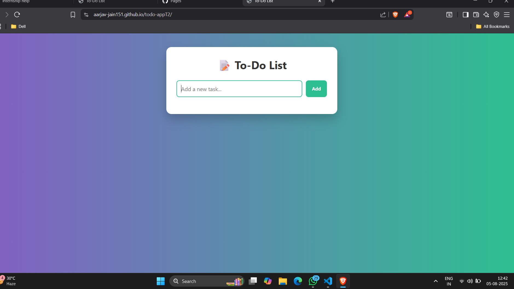

# ✅ To-Do List Web App — Internship Task 2

This is a sleek and responsive **To-Do List App** built using **HTML, CSS, and Vanilla JavaScript** as part of my internship project.

---

### 🔗 Live Preview

👉 [Click here to view the live app](https://aarjav-jain151.github.io/todo-appT2/)

---

### 📸 Screenshot

---

### 🚀 Features

- ✏️ Add new tasks
- ✅ Mark tasks as complete
- ❌ Delete tasks
- 🎨 Clean and modern UI
- ⚡ Instant updates — no reloads
- 📱 Fully responsive (works on all devices)

---

### 🧠 What I Learned

- DOM Manipulation in JS
- Event Handling using `addEventListener`
- Toggling Classes and Updating the UI dynamically
- Building a responsive layout with Flexbox
- Clean code structure and GitHub workflow

---

### 🧰 Tech Stack

- HTML5
- CSS3
- JavaScript (Vanilla)
- Live Server (VS Code Extension)
- Git & GitHub

---

> 💡 **Note**: This project is frontend-only — no backend/database is used.

---

👨‍💻 Created with 💙 by Aarjav Jain
